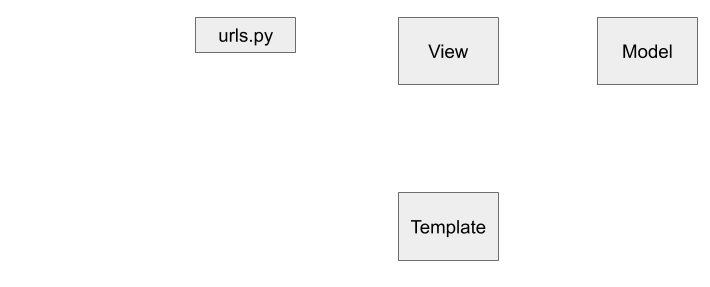
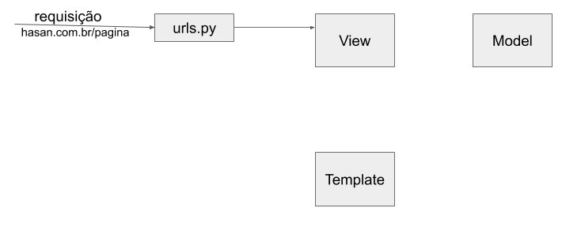
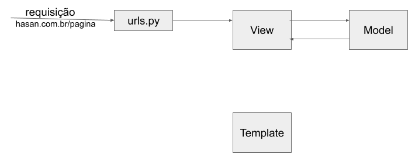

<!-- {"layout": "title"} -->
# Django Templates e Views
## Templates, Views, arquivos estáticos e URLs
---
## Principais Componentes  Django

- **Template**: Exibição do html (usualmente, dinâmico)
- **View**: Tratamento da requisição, elaboração da resposa, geralmente, por meio da renderização  de um **template**. Se necessário, consultando o banco de dados pelos **models**
- **Models**: Responsável pela persistência/gerenciamento dos dados

---
## Relação Entre os Componentes
::: figure .figure-slides.clean
 <!-- {.bullet.figure-step.bullet-no-anim} -->
 <!-- {.bullet.figure-step.bullet-no-anim} -->
 <!-- {.bullet.figure-step.bullet-no-anim} -->
 <!-- {.bullet.figure-step.bullet-no-anim} -->
 <!-- {.bullet.figure-step.bullet-no-anim} -->
 <!-- {.bullet.figure-step.bullet-no-anim} -->
:::

---
## Arquivos do projeto


---
## Templates

- Facilita a geração de páginas dinâmicas

- Possui:
  - Parte estática do conteúdo
  - Sintaxe para tratar a parte dinâmica

- **Sintaxe para apresentação**: Não é possível executar códigos Python no template.
---
## Templates - Exemplo no Jupyter

```python
from django.template import engines
django_engine = engines['django']
template = django_engine.from_string("Ola {{ name }}!")
dado = {'name':'Hasan'}
template.render(dado)
```

:::result

Ola Hasan!

:::

---
## Templates - Configuração

```python
TEMPLATES = [
    {
        'BACKEND': 'django.template.backends.django.DjangoTemplates',
        'DIRS': [os.path.join(BASE_DIR, 'dir_templates')],
        'APP_DIRS': True,
        'OPTIONS': {
            # ... some options here ...
        },
    },
]
```
- [Veja opções do atributo **options** aqui](https://docs.djangoproject.com/en/3.1/topics/templates/#django.template.backends.django.DjangoTemplates)

---
<!-- {"layout": "2-column-content"} -->
## Template inclusão e herança de templates
```html
<html>
  <head>
    <title>Pagina Supimpa - Home</title>
    <link rel="stylesheet" href="estilos.css">
  </head>
  <body>
    <nav><ul><li>Home</li><li>História</li></ul>
    <main>conteudo do home :D</main>
  <body>
</html>
```
```html
<html>
  <head>
    <title>Pagina Supimpa - História</title>
    <link rel="stylesheet" href="estilos.css">
  </head>
  <body>
    <nav><ul><li>Home</li><li>História</li></ul>
    <main>conteudo da história :D</main>
  <body>
</html>
```
---
## Template inclusão e herança de templates
- **principal.html**:<!-- {li:style="display: inline-block; width:60%;border-right:1px dashed black; padding-right: 10px;font-size:0.8em;"}-->
  ```html
  <html>
    <head>
      <title>Pagina Supimpa - </title>
      <link rel="stylesheet" href="estilos.css">
    </head>
    <body>
      
      <main></main>
    <body>
  </html>
  ```
  **menu.html:**
  ```html
  <nav><ul><li>Home</li><li>História</li></ul>
  ```
- **home.html**:<!-- {li:style="display: inline-block; width:35%;border-right:1px dashed black; padding-right: 10px;font-size:0.8em;"}-->
  ```html
  
  Home
  
  Conteúdo do Home :D
  
  ```
  **história.html**:
  ```html
  
  Hitória
  
  História :D
  
  ```
---
## Sintaxe do template

- Impressão de variáveis no HTML
```html
  <p>Ola! Meu nome é <strong>{{nome}}</strong>!</p>
```

---
## Sintaxe do Template

```python
from django.template import engines
django_engine = engines['django']
dados_pagina = {
                   "cliente":{
                     "nome":"Alice",
                     "endereco":{"rua":"A","numero":2010,
                                 "bairro":"Esperança","Cidade":"Belo Horizonte",
                                 "Estado":"MG"
                                 },
                      "telefones":["(31) 555-4444","(31) 999-4444"]
                   }
                }
template = django_engine.from_string("Ola {{ cliente.nome }}! Telefone: {{cliente.telefones.0}}")
template.render(dados_pagina)
```

---
## Sintaxe do template

- Condicionais
```html

  Atletas: {{ athlete_list|length }}

  Não há atletas.

```

- Estrutura de Repetição
```html
<ul>

    <li>{{ athlete.name }}</li>

    <li>Não há atletas cadastrados </li>

</ul>
```
[Mais tags e filtros Django](https://docs.djangoproject.com/pt-br/3.0/ref/templates/builtins)

---
## Views

- Views são responsáveis por:
  - Obter e processar a requisição
  - Responder a requisição. Se necessário:
    - Insere/consulta/atualiza/remove instancias
    - Indica o template a ser renderizado

---
<!-- { "slideHash": "urls"} -->
## URLs

- O arquivo `urls.py` indica quais URLs estão disponíveis em um projeto Django
- Altere a lista `urlpatterns` deste arquivo com os endereços desejados

```python
from app_projeto.views import *
from django.views.generic.base import TemplateView
urlpatterns = [
    path('articles/<int:year>/', Post.as_view(),name='articles_per_year'),
    path('', TemplateView.as_view(template_name="home.html"),name='home'),
]
```

- Cada elemento da lista possui um `path` com os parametros: endereço, view e nome
- o nome pode ser referenciado no template para ser gerado a url:
  ```html
  <a href=''>Home</a>
  <a href=''>2003 Posts</a>
  ```
---
<!-- {"layout": "2-column-content"} -->
## View - Processamento de uma requisição

```python
from django.shortcuts import render
from django.views import View

class Home(View):
    def get(self, request):
        lista_itens = [{"titulo":"De onde eles vêm",
                        "texto":"Lorem ipsum dolor sit amet, consectetur"},
                        {"titulo":"O que eles querem",
                        "texto":"osakdpokasdokaspok"},
                      ]
        itens = {'lista_itens':lista_itens }
        return render(request,"home.html",itens)
```

```html
  
    <li><strong>{{ item_sobre.titulo}}:</strong>
                  {{item_sobre.texto}}
    </li>
  
    Não <strong>há</strong> sobre ainda :-(
  
```
---
<!-- { "slideHash": "urls-views"} -->
## URLs

Para criar a URL, referencie a view criada:

```python
from app_projeto.views import *
from django.views.generic.base import TemplateView
urlpatterns = [
    path('', Home.as_view(),name='home'),
]
```

---
<!-- { "slideHash": "urls-params"} -->
## URLs - Processando URL com parametros


URL:
~ ```python
  urlpatterns = [
      path('diga-ola-para:<str:nome>/<str:cidade>', Ola.as_view(), name='oi'),
      ]
  ```
View:
~  ```python
  class Ola(View):
      def get(self, request, nome,cidade):
          return render(request,
                          "ola.html",
                          {'nome_pessoa': nome,'cidade':cidade})
  ```
Template:
~  ```html
    <p>Ola <strong>{{ nome_pessoa }}</strong> de {{cidade}}!</p>
  ```
Ao acessarmos: `http://127.0.0.1:8000/diga-ola-para:Hasan/BH` será renderizado:

```html
  <p>Ola <strong>Hasan</strong> de BH!</p>
```
---
<!-- { "slideHash": "static"} -->
## Arquivos estáticos
- Salvamos os arquivos estaticos (imagens, CSS e JS) em uma pasta separada
- Pasta de nome `static`, por padrão, fica dentro a pasta do **app** podendo ser alterada em `settings.py`
- `load static`: Comando para usarmos os endereços estáticos
- `static`: comando/tag Para que seja renderizado um endereço estático
```html

<html>
  <head>
    <title>Pagina Supimpa - </title>
    <link rel="stylesheet" href="">
  </head>
  <body>
    
    <main></main>
  <body>
</html>
```
---
# Prática 1 - Exploração Espacial


Objetivo: treinar criação de templates e entender sua organização e como configurá-lo. [Clique aqui e veja a especificação](https://github.com/daniel-hasan/cefet-web-grad/blob/master/assignments/tasks/template/README.md)

---
## Uso de form
- Para usarmos formulários HTMLs, primeiramente podemos criar um formulario como uma classe Python. Por exemplo:
```python
from django import forms
class PessoaForm(forms.Form):
    nome = forms.CharField(label='Nome:', max_length=100)
    data_nascimento = forms.DateField(label="Data Nascimento")
```
- Além de renderizar o HTML, formulários fazem a validação, limpeza/tratamento dos dados

---
## Form - Construtor, atributos e Métodos úteis
- Form(dados,arquivos,initial)
  - dados: dicionário com todos os seus campos e valores
  - arquivos: dicionário que para cada campo que é um arquivo, o ponteiro para o mesmo
  - initial: Dados iniciais (se os dados não forem fornecidos)
- **métodos**
  - `is_valid()`: verifica se o formulário está valido
  - `as_ul()`: renderiza em HTML o form como uma lista
  - `as_p()`: renderiza em HTML o form como usando parágrafos
  - `as_table()`: renderiza em HTML o form como uma table (padrão)
- **atributos**
  - `errors`: dicionário com os erros nos campos preenchidos
  - `cleaned_data`: dicionário com os dados já processados. Só existe após executarmos `is_valid`
---
## Form - Exemplo no Jupyter
```python
teste_1 = PessoaForm({"nome":"","data_nascimento":"oioi"})
print(f"Erros 1: {teste_1.errors} is valid? {hasan.is_valid()}")

teste_2 = PessoaForm({"nome":"Daniel Hasan","data_nascimento":"1984-04-14"})
print(f"Erros 2: {hasan.errors} is valid? {hasan.is_valid()}")

print("Cleaned_data: {hasan.cleaned_data}")

print()
''
```
:::result
Erros 1: {'nome': ['This field is required.'], 'data_nascimento': ['Enter a valid date.']} is valid? False<br>
Erros 2: {} is valid? True<br>
Cleaned_data: {'nome': 'Daniel Hasan', 'data_nascimento': datetime.date(1987, 3, 2)}
:::
---
## Form - exemplo no Jupyter (continuação) - as_p
```python
print(teste_2.as_p())
```
Resultado:
```html
<p><label for="id_nome">Nome:</label>
    <input type="text" name="nome" value="Daniel Hasan" required id="id_nome" maxlength="100">
  </p>
<p><label for="id_data_nascimento">Data Nascimento:</label>
  <input type="text" name="data_nascimento" value="1984-04-14" required id="id_data_nascimento">
</p>
```
---
## View - Processamento de uma requisição
<style>
pre{
  max-height: 40vh;
}
</style>
- View:<!-- {li:style="display: inline-block; width:60%;border-right:1px dashed black; padding-right: 10px;font-size:0.8em;"}-->
  ```python
  from django.shortcuts import render
  from django.views import View
  from datetime import date
  from django import forms
  from django.urls.base import reverse
  class PessoaForm(forms.Form):
      nome = forms.CharField(label='Nome:', max_length=100)
      data_nascimento = forms.DateField(label="Data Nascimento")
  class Contato(View):
      def get(self, request):
        return render(request,
                            "contato.html",
                            {"contato":PessoaForm(initial={"data_nascimento":date.today()})})
      def post(self,request):
        form = PessoaForm(request.POST)
        if form.is_valid():
          # processa o formulario (usando form.cleaned_data)
          return HttpResponseRedirect(reverse('success') )

        return render(request, "contato.html", {'contato': form})
  ```
- Template:<!-- {li:style="display: inline-block; width:35%;padding-right: 10px;font-size:0.8em;"}-->
  ```html
    <h2>Contatos</h2>
    <form method="post">
       
       {{ contato }}
       <button>Enviar</button>
    </form>
  ```

[Formas de exibir o formulário](https://docs.djangoproject.com/en/3.0/ref/forms/api/)


---
<!-- { "slideHash": "model-form"} -->
## Model Form

Considere a classe pessoa:
```python
class Pessoa(models.Model):
  nome = models.CharField(max_length=100)
  data_nascimento = models.DateField()
  def __str__(self):
      return f"{self.nome} - {self.data_nascimento}"

```

Se desejarmos atualizar dados da pessoa por meio de formulários, usamos o ModelForm:
```python
from django import forms
class PessoaForm(forms.ModelForm):
    class Meta:
        model = Pessoa
        fields = ['nome', 'data_nascimento']
        labels = {"data_nascimento": "Data de Nascimento"}
```
---
## ModelForm - Uso

- Construtor: ModelForm(dados,arquivos,instance)
  - `dados`: Valores que foram preenchidos no formulário
  - `arquivos`: Apontador para os arquivos enviados (opcional)
  - `instance`: Instancia a ser alterada (opcional)

Método save: atualiza/insere a entidade de acordo com os dados passados no construtor

---
## Model Form - exemplo no Jupyter - form vazio
```python
form = PessoaForm()
print(form.as_p())

```
Resultado:
```html
<p>
  <label for="id_nome">Nome:</label>
  <input type="text" name="nome" required id="id_nome" maxlength="100">
</p>
<p>
  <label for="id_data_nascimento">Data de Nascimento:</label>
  <input type="text" name="data_nascimento" required id="id_data_nascimento">
</p>
```
---
## Model Form - exemplo no Jupyter - inserção
```python
dados_recebidos = {"nome":"Hasan","data_nascimento":"1990-02-20"}
form = PessoaForm(dados_recebidos)
print(form.as_p())
if form.is_valid():
  form.save()
hasan = form.instance
```
Resultado:
```html
<p>
  <label for="id_nome">Nome:</label>
  <input type="text" name="nome" value="Hasan" required id="id_nome" maxlength="100">
</p>
<p>
  <label for="id_data_nascimento">Data de Nascimento:</label>
  <input type="text" name="data_nascimento" value="1990-02-20" required id="id_data_nascimento">
</p>
```
---
## Model Form - exemplo no Jupyter (2/2)
```python
dados_recebidos = {"nome":"Hasan Dalip","data_nascimento":"1970-02-20"}
form = PessoaForm(dados_recebidos,instance=hasan)
if form.is_valid():
    form.save()
print(form.as_ul())
```
Resultado:
```html
<p>
  <label for="id_nome">Nome:</label>
  <input type="text" name="nome" value="Dani" required id="id_nome" maxlength="100">
</p>
<p>
  <label for="id_data_nascimento">Data de Nascimento:</label>
  <input type="text" name="data_nascimento" value="1970-02-20" required id="id_data_nascimento">
</p>
```

---
<!-- { "slideHash": "model-form-ex"} -->
## Exemplo de inserção/listagem com ModelForm

<style>
p{
    line-height:1;
    margin: 0px;
}
</style>

- urls.py:<!-- {li:style="display: inline-block; width:45%;border-right:1px dashed black; padding-right: 10px;font-size:0.8em;"}-->
  ```python
  urlpatterns = [
      path('pessoa/insere', SalvarPessoa.as_view(), name='inserir'),
      path('', ListarPessoas.as_view(), name='lista_pessoas'),
      ]
  ```
  View:
  ```python
  from django.http import HttpResponseRedirect
  from django.url import reverse
  class ListarPessoas(View):
    def get(self,request):
      lst_pessoas = Pessoa.objects.all().values("id","nome")
      return render(request,"listar_pessoas.html",{"pessoas":lst_pessoas})
  class SalvarPessoa(View):
      def get(self,request): #Requisitou a exibição do formulário
          return render(request,"salvar_pessoa.html",{"pessoa":PessoaForm()})

      def post(self,request):#via post, salva a pessoa
          form = PessoaForm(request.POST,request.FILES)

          if form.is_valid():
              form.save()
              return HttpResponseRedirect(reverse('listar_pessoas') )
          else:
              return render(request,"salvar_pessoa.html",{"pessoa":form})
  ```

- listar_pessoas.html:<!-- {li:style="display: inline-block; width:50%;font-size:0.8em;position:relative;top:-3em;"}-->
  ```html
  <ul>
      
        <li>{{pessoa.nome}}</li>
      
  </ul>
  ```

  salvar_pessoas.html:
  ```html
  <h2>Salvar Pessoa</h2>
  <form method="post">
     
     {{ pessoa }}
     <button>Enviar</button>
  </form>
  ```

---
<!-- { "slideHash": "model-form-ex"} -->
## Exemplo de atualização com ModelForm

<style>
p{
    line-height:1;
    margin: 0px;
}
</style>

- urls:<!-- {li:style="display: inline-block; width:45%;border-right:1px dashed black; padding-right: 10px;font-size:0.8em;"}-->
  ```python
  urlpatterns = [
      path('pessoa/<int:id>', SalvarPessoa.as_view(),name='atualizar'),
      path('pessoa/insere', SalvarPessoa.as_view(), name='inserir'),
      path('', ListarPessoas.as_view(), name='listar_pessoas'),
      ]
  ```
  View:
  ```python
  from django.http import HttpResponseRedirect
  from django.url import reverse
  class ListarPessoas(View):
    def get(self,request):
      lst_pessoas = Pessoa.objects.all().values("id","nome")
      return render(request,"listar_pessoas.html",{"pessoas":lst_pessoas})

  class SalvarPessoa(View):
      def get(self,request,id=None): #Requisitou a exibição do formulário
          pessoa = Pessoa.objects.get(id=id) if id != None else None
          return render(request,"salvar_pessoa.html",{"pessoa":PessoaForm(instance=pessoa)})

      def post(self,request,id=None):#via post, salva a pessoa
          pessoa = Pessoa.objects.get(id=id) if id != None else None
          form = PessoaForm(request.POST,request.FILES, instance=pessoa)

          if form.is_valid():
              form.save()
              #se estiver ok, salva e lista as pessoas
              return HttpResponseRedirect(reverse('listar_pessoas') )
          else:
              #caso nao esteja valido, volte a exibir o formulario
              return render(request,"salvar_pessoa.html",{"pessoa":form})
  ```

- listar_pessoas.html:<!-- {li:style="display: inline-block; width:50%;font-size:0.8em;position:relative;top:-3em;"}-->
  ```html
  <ul>
      
        <li><a href="">{{pessoa.nome}}</a></li>
      
  </ul>
  ```

  salvar_pessoas.html:
  ```html
  <h2>Salvar Pessoa</h2>
  <form method="post">
     
     {{ pessoa }}
     <button>Enviar</button>
  </form>
  ```
---
## Práticas

- **Prática 2**: Gerenciamento dos Tesouros do Barba-Ruiva
	- Objetivo:  treinar a criação de visões e templates, acesso ao modelo pela visão [Veja a especificação aqui](https://github.com/daniel-hasan/cefet-web-pirates-django). Este GitHub possui o código inicial. Para fazer esta implementação, faça download deste repositório (ou faça um fork).

- **Prática 3**: Há uma forma ainda mais simples para trabalhar com requisições Web usando Django! [Siga as instruções aqui](https://github.com/daniel-hasan/cefet-web-pirates-django-generic) para usar [Generic Views](https://docs.djangoproject.com/pt-br/3.0/topics/class-based-views/generic-editing/#model-forms) e deixar o código ainda mais lindão e simples :). Neste exemplo, você poderá também trabalhar com autenticação de usuário.
---
## Testes unitários

- Testes automatizados são uma boa prática de programação:
  - Simples verificação
  - Pode-se usar ferramentas como o [bitbucket Pipelines](https://confluence.atlassian.com/bitbucket/get-started-with-bitbucket-pipelines-792298921.html) para sempre verificar estes testes.
- É possível, dentre outras possibilidades, simular requisições e autenticações

---
## Testes unitários - procedimento

- Cria-se uma classe de teste
- Nessa classe, cria-se os métodos de teste com prefixo `test` e, se necessário, o método `setUp` para sua inicialização

- Para garantir independencia entre testes, quando o teste é executado, é criado uma base de dados nova  e, para cada método de teste, antes do mesmo ser executado:
  - Todos os dados são excluídos
  - É executado o método `setUp`

- [Veja documentação](https://docs.djangoproject.com/en/3.0/topics/testing/tools/)
---
## Teste unitário em nosso exemplo - Inicialização

```python
from django.test.client import Client
from django.test.testcases import TestCase
from .models import Pessoa
from .views import ListarPessoas, SalvarPessoa
from datetime import date
from django.urls import reverse

class TestPessoaViews(TestCase):

    def setUp(self):
        self.pessoas_inseridas = []
        self.pessoas_inseridas.append(Pessoa.objects.create(nome="Alice", data_nascimento= date(2020,1,20)))
        self.pessoas_inseridas.append(Pessoa.objects.create(nome="Bob", data_nascimento=date(2019,2,19)))
        #cria usuario para posterior autenticação
        #. Não é necesssário no nosso exemplo, mas usualmente, precisamos em nossos testes
        #self.senha_autenticacao = "secret_c0de"
        #self.my_admin = User.objects.create_superuser('myuser', 'myemail@test.com',
        #                                                    self.senha_autenticacao)
```
---
## Teste unitário em nosso exemplo - Teste de Listar pessoas

```python
class TestPessoaViews(TestCase):
  def test_listar_pessoas(self):
      c = Client()

      #Autentica
      #. não é necessário em nosso exemplo, porém é uma funcionalidade
      #. muito util!
      #c.login(username=self.my_admin.username, password=self..senha_autenticacao)

      #faz a requisição
      str_url = reverse("listar_pessoas")
      resposta = c.get(str_url)
      #obtem dados da resposta
      dados_resposta = resposta.context

      #realiza o teste - se a lista de pessoas inserida é igual à obtida pela resposta
      lst_pessoas_resposta = dados_resposta["pessoas"]

      for pessoa_resposta in lst_pessoas_resposta:
          #procura pessoa no pessoas_inseridas
          encontrou = False
          for pessoa_inserida in self.pessoas_inseridas:
              if pessoa_resposta["id"] == pessoa_inserida.id:
                  encontrou = True
                  self.assertEqual(pessoa_resposta["nome"],pessoa_inserida.nome,"Nome inesperado ao listar pessoas")
          self.assertTrue(encontrou, f"A pessoa {pessoa_resposta} não foi encontrada")
      self.assertEqual(len(self.pessoas_inseridas),len(lst_pessoas_resposta),
                      "O número de pessoas inseridas é diferente do obtido na resposta!")
```
---
## Teste unitário em nosso exemplo - Teste de inserção

```python
class TestPessoaViews(TestCase):
  def test_inserir(self):
      c = Client()
      #c.login(username=self.my_admin.username, password=self.senha_autenticacao)

      #faz a requisição
      str_url = reverse("inserir")
      c.post(str_url, {"nome":"Carol","data_nascimento":"2020-02-01"})

      #testes
      lstPessoasCarol = Pessoa.objects.filter(nome="Carol",
                                              data_nascimento=date(2020,2,1))
      self.assertNotEquals(0,len(lstPessoasCarol),
                      "Não foi possível encontrar a instancia inserida")
      self.assertEquals(1,len(lstPessoasCarol),
              "A instancia foi inserida mais de uma vez")
```
---
## Teste unitário em nosso exemplo - Teste de atualização

```python
class TestPessoaViews(TestCase):
  def test_atualizar(self):
      c = Client()
      #c.login(username=self.my_admin.username, password=self.senha_autenticacao)

      #faz a requisição
      id_atualizar = self.pessoas_inseridas[0].id
      str_url = reverse("atualizar",kwargs={"id":id_atualizar})
      c.post(str_url, {"nome":"Daniel","data_nascimento":"2020-01-23"})

      #testes
      lstPessoasCarol = Pessoa.objects.filter(id=id_atualizar)
      self.assertEquals(1,len(lstPessoasCarol),
                      "Não foi possível encontrar a instancia atualizada")

```
---
## Respostas via Ajax (1/2)
- Se necessário, veja aula Ajax: [slides](https://fegemo.github.io/cefet-front-end/classes/js7/)/[vídeo-aula](https://www.youtube.com/watch?v=STXnmGs3wuA&list=PLNaBD3CnN0-8b7lNxYp5GP_uajyFRn2ek&index=102)
- Resposta **apenas** em JSON
  ```python
  from django.http import HttpResponseRedirect, JsonResponse
  from django.url import reverse

  class ListarPessoas(View):
    def get(self,request):
      lst_pessoas = list(Pessoa.objects.all().values("id","nome"))
      return JsonResponse({"pessoas":lst_pessoas})

  ```
---
## Respostas via Ajax (2/2)
- Resposta em JSON caso seja uma requisição Ajax
  ```python
  from django.http import HttpResponseRedirect
  from django.url import reverse

  class ListarPessoas(View):
    def get(self,request):
      lst_pessoas = list(Pessoa.objects.all().values("id","nome"))
      if request.is_ajax():
        return render(request,"listar_pessoas.html",{"pessoas":lst_pessoas})
      else:
        return JsonResponse({"pessoas":lst_pessoas})
  ```

- Para aplicações que façam um grande uso dessas requisições, considerar usar a API Rest: [Veja documentação](https://www.django-rest-framework.org/), [Veja um exemplo](https://medium.com/@marcosrabaioli/criando-uma-api-rest-utilizando-django-rest-framework-parte-1-55ac3e394fa)
  - Nele, é possivel implementar inclusive autenticação para requisições deste tipo ([ver exemplo](https://medium.com/@marcosrabaioli/django-rest-framework-e-django-oauth-toolkit-c71f8920db08))

---
# Prática 4

Por fim, faça testes unitários na Prática 3 para as operações de busca, atualização, remoção e inserção dos dados. Além disso, use Ajax para obter a lista de tesouros e remover um tesouro.
---
# Referências

1. https://docs.djangoproject.com
1. https://simpleisbetterthancomplex.com/
1. https://tutorial.djangogirls.org/pt/
